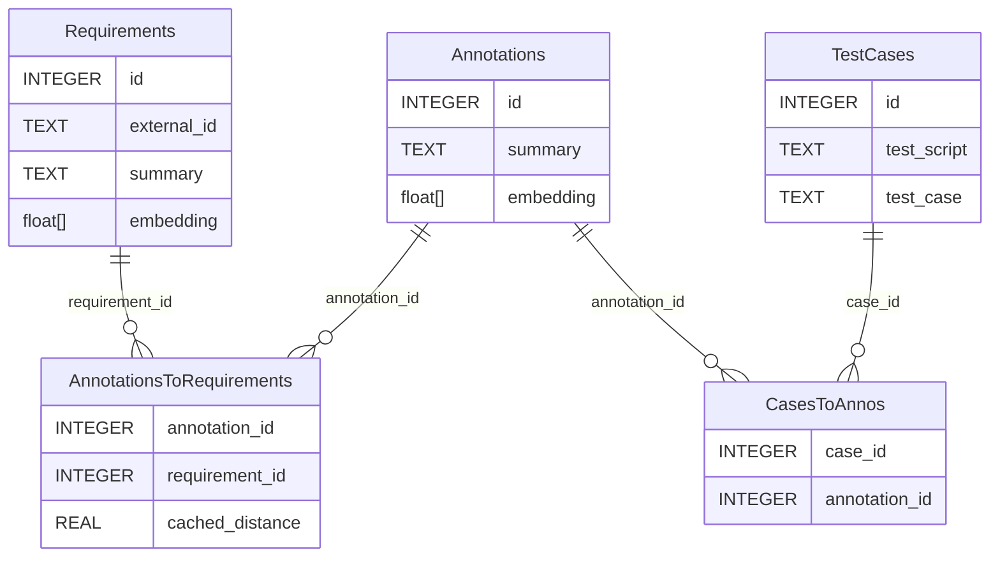

## Setup

This project uses UV to manage the virtual environment. To install UV, run the following command:

```bash
pip install uv
```

To create the virtual environment, run the following command:

```bash
uv venv
```

To install the dependencies, run the following command:

```bash
uv sync
```

## How it works

We use [`nomic-ai/nomic-embed-text-v1`](https://huggingface.co/nomic-ai/nomic-embed-text-v1) to create embeddings from text. 
We then store these embeddings in a SQLite database. 
We use the [`sqlite-vec`](https://github.com/asg017/sqlite-vec) library to store and query the embeddings.

### Database



## Usage

1. Add your artifacts to the `private` directory.
2. Run `index_annotations.py` to index the annotations. It also fills information about the test cases.
3. Run `index_requirements.py` to index the requirements.
4. Run `link_reqs_to_annos.py` to find the closest annotations to each requirement and cache this data in 
   `CasesToAnnos` table.
5. Create report about the coverage of the requirements by the test cases:
    - By running your SQL queries in `requirements.db` SQLite database.
    - Or by running `report.py` script.