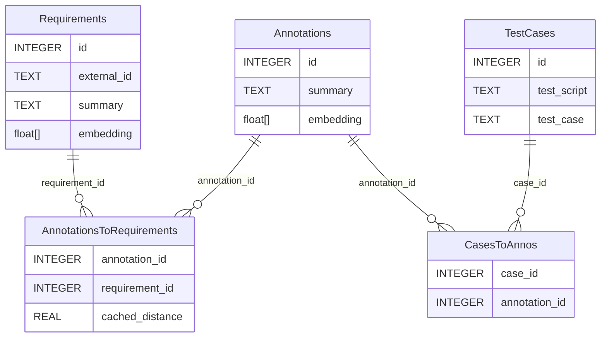

## Setup

This project uses: 
- python version higher than 3.9 with sqlite version higher than 3.35 with option enable load extentions.
- UV to manage the virtual environment. To install UV, run the following command:

```bash
pip install uv
```

To create the virtual environment, run the following command:

```bash
uv venv
```

To install the dependencies, run the following command:

```bash
uv sync
```

### PyTorch version

PyTorch is default set to CPU distributive:

```toml
[tool.uv.sources]
torch = {index = "pytorch-cpu"}
```

If you want to use a CUDA distributive, replace index with one of the following values:

- `pytorch-cu118`
- `pytorch-cu124`
- `pytorch-cu126`

Regenerate lock file:
```shell
uv lock
```

> Please do not commit updated lock file into GIT

Install dependencies from the updated lock file:

```shell
uv sync
```

## How it works

We use [`nomic-ai/nomic-embed-text-v1`](https://huggingface.co/nomic-ai/nomic-embed-text-v1) to create embeddings from text. 
We then store these embeddings in a SQLite database. 
We use the [`sqlite-vec`](https://github.com/asg017/sqlite-vec) library to store and query the embeddings.

### Database



## Usage

To run UI of this app use following command:

```shell
streamlit run main.py
```

For running first time use following command to install dependencies if necessary

```shell
uv run streamlit run main.py
```