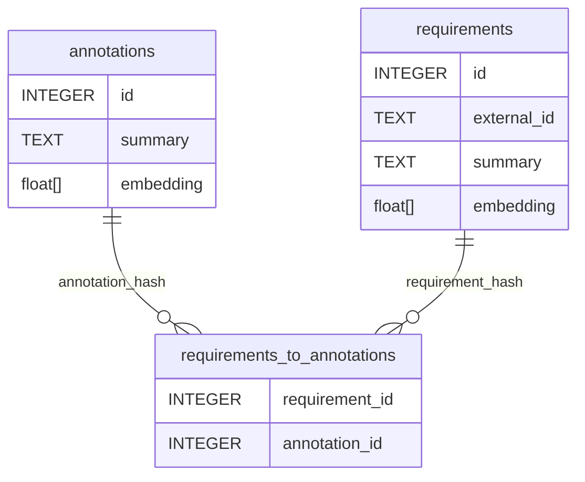

## Setup

External libraries:
- https://github.com/asg017/sqlite-vec

## Database

```mermaid
erDiagram
    annotations {
        INTEGER id
        TEXT summary
        float[] embedding
    }
    requirements {
        INTEGER id
        TEXT external_id
        TEXT summary
        float[] embedding
    }
    
    requirements_to_annotations {
        INTEGER requirement_id
        INTEGER annotation_id
    }
    
    annotations ||--o{ requirements_to_annotations : annotation_hash
    requirements ||--o{ requirements_to_annotations : requirement_hash
```